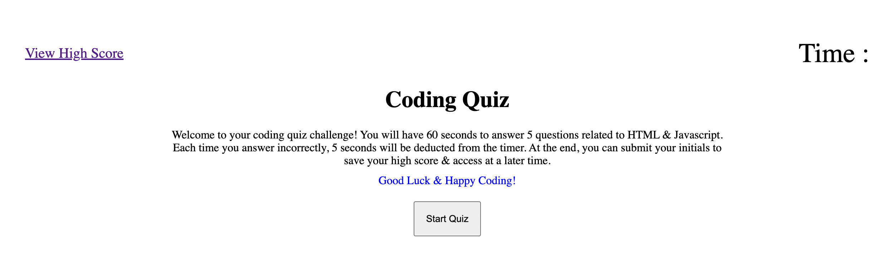
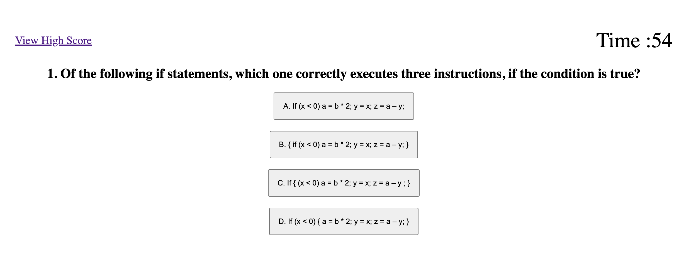
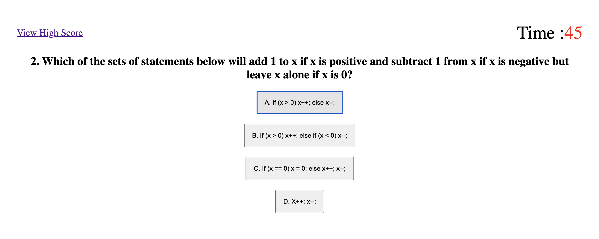
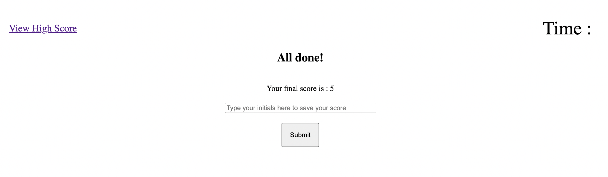
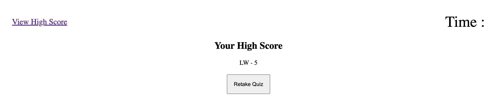

# timed-quiz-with-saved-high-scores

## Interactive Timed Multiple Choice Quiz Where User Can Save Scores

This quiz was created to challenge my skills with dynamically created elements in Javascript. It responds to user interactions with the interface & saves scores in local storage for users to access later. This is a great tool that can be used not only for quiz-taking but also for computer games. Even when users restart their page OR quit their browser, they can always come back to the link & challenge their old score. This is a great way to create a dynamic webpage that feels personal to users. 

This biggest challenge of this application was learning how to create content that would change based on user interaction. This is the first time I have worked with this concept so the code can be a bit DRY. It gave me some great focus areas of where I need to learn to condense my code. I have yet to completely wrap my mind around for loops but this project was a great lesson in showing where a possible for loop could be entered i.e. for each question & answer options. For now, I needed to separate each one so that I could understand the basic processes of how a computer reads & renders information to the page. A great exercise in Javascript dynamic functioning & really gave me great appreciation for all things Javascript! I can see most of my projects utilizing a majority of Javscript code moving forward.

Technologies used : HTML5, Advanced CSS, Javascript

To access the deployed application, please click here : https://lyndseyjw.github.io/timed-quiz-with-saved-high-scores/

This project is licensed under the terms of the MIT license.

You may contact the sole contributor at lyndseyjwatson@gmail.com

